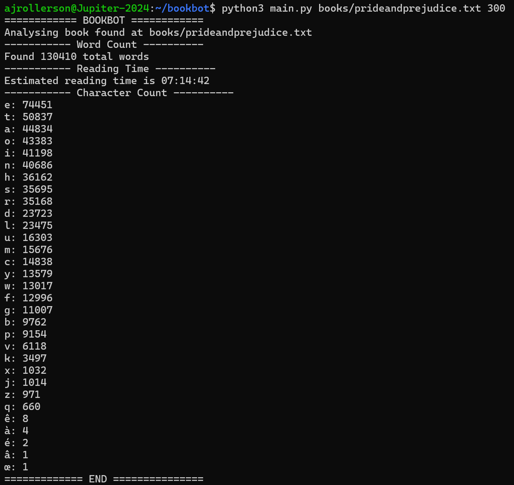
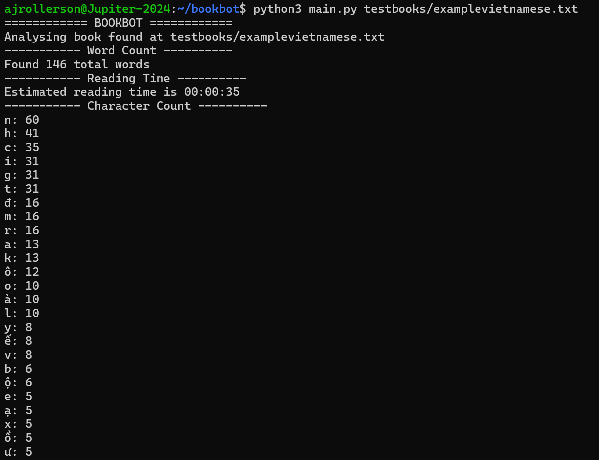

# Bookbot
Bookbot is a Python application that analyses text files by calculating word and character statistics. The project began as a guided Boot.dev assignment before being extended with reading-time estimation and tested against text in multiple languages.

## Technical Highlights
- Command-line argument handling
- Unicode text processing
- Modular Python architecture
- Input validation and error handling

## Tech Stack
- Python

## Demo
### Pride and Prejudice

Demonstration calculating stats for 'Pride and Prejudice'.



### Vietnamese Text Demonstration

Demonstration calculating stats for a Vietnamese example text (abridged).



## Quick Start
The following commands assume a Bash/WSL environment.
### Clone the Repository
```bash
git clone https://github.com/ajrollerson/bookbot.git
cd bookbot
```

### Run the Application
```bash
python3 main.py <file_path> [wpm]
```

Note: Current books can be found in /books, while test documents for other languages can be found in /testbooks.

### Example: Moby-Dick
```bash
python3 main.py books/mobydick.txt 300
```

### Example Japanese Text
```bash
python3 main.py testbooks/examplejapanese.txt
```

Note: if no valid WPM argument is provided, a default value of 250 will be used.

## Key Features
### Core Functionality
- Character count (Unicode-supported)
- Word counting using whitespace delimiters
- Case-insensitive processing
- Command-line interface

### Independent Extension
- Implemented estimated reading-time calculation using user-supplied or default words-per-minute values

## Design Choices
### Reading-Time Estimate
Reading-time estimation was added as an additional statistic alongside the existing word and character counts. The calculation uses the document's word count and a user-supplied words-per-minute value, with a default value of 250 provided when no valid WPM argument is supplied. This keeps the feature optional while allowing users to adjust the estimate according to their reading speed.

## Known Limitations
- Word counting relies on whitespace delimiters and therefore does not accurately represent word boundaries in languages such as Chinese and Japanese
- Bookbot does not currently detect the language of an input document and applies the same word-counting approach to all text

## Future Improvements
- Add language-specific parsing modules for Chinese, Japanese, Hindi, and other languages 

